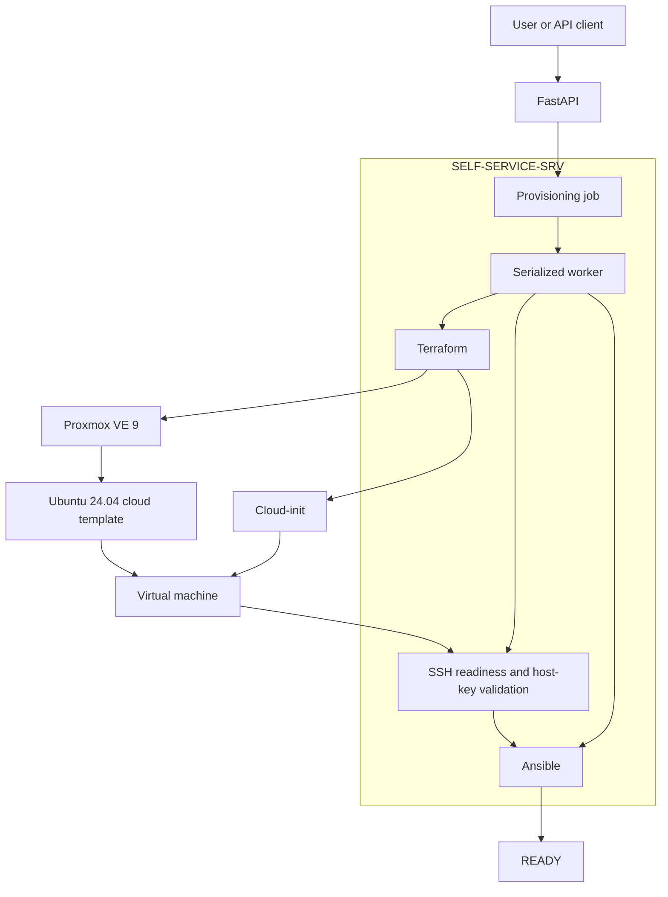
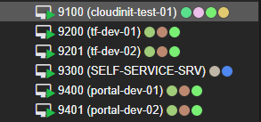
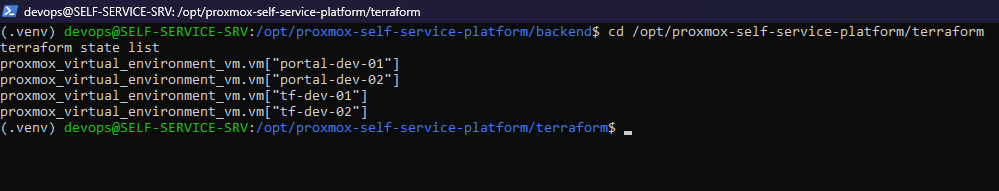
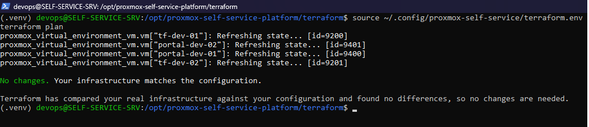
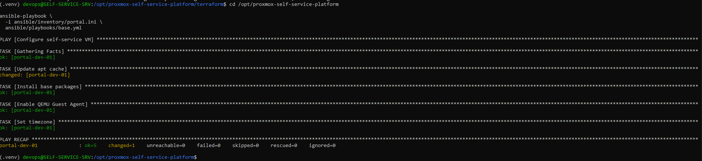
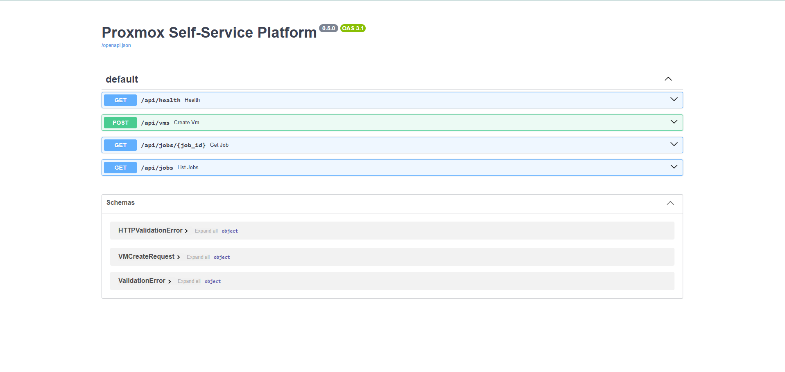
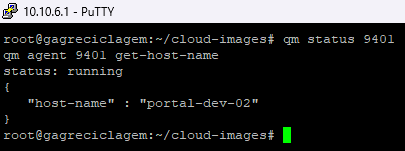

# Proxmox Self-Service VM Platform

An internal infrastructure self-service platform that provisions and configures virtual machines on Proxmox VE through FastAPI, Terraform, Cloud-init, SSH, and Ansible.

The project demonstrates a practical Platform Engineering workflow: an API request becomes a tracked provisioning job, infrastructure is created through code, the guest is securely reached over SSH, configuration management converges the operating system, and the job is marked `ready` only after the complete pipeline succeeds.

> Project status: functional lab prototype. The provisioning pipeline has created multiple Ubuntu VMs end to end; production controls such as authentication, persistent jobs, distributed locking, and approvals are planned.

## Overview

Manual VM creation usually spans several disconnected steps: choosing IDs and addresses, cloning a template, configuring resources and Cloud-init, waiting for the guest, managing SSH trust, and applying an operating-system baseline. This project coordinates those steps behind a small API.

The automation runtime is centralized on `SELF-SERVICE-SRV`, which runs FastAPI, Terraform, Ansible, and the provisioning worker. Terraform state and automation identities therefore no longer depend on a personal workstation.

## Architecture



See [Architecture](docs/architecture.md) for component boundaries, credential flow, failure handling, and detailed diagrams.

## Demo / Provisioning Flow

```text
POST /api/vms
      |
      v
queued -> allocating -> planning -> applying
                                      |
                                      v
                         waiting_for_ssh
                                      |
                                      v
                         registering_host_key
                                      |
                                      v
                           configuring -> ready
```

Infrastructure existing in Proxmox is not considered the end state. A job reaches `ready` only after SSH is reachable, the host key is registered, and Ansible completes successfully.

## Features

- Asynchronous VM provisioning API with job tracking.
- Input validation for VM name, CPU, memory, and disk.
- Automatic VMID allocation from the portal range.
- Automatic static IPv4 allocation from the LAB pool.
- Terraform `for_each` model for stable multi-VM management.
- Proxmox template cloning with CPU, RAM, disk, and network configuration.
- Cloud-init bootstrap with dedicated automation public keys.
- Serialized Terraform execution to protect shared state.
- SSH readiness checks with a bounded timeout.
- Dedicated platform `known_hosts` and strict host-key checking.
- Temporary Ansible inventory generated per provisioning job.
- Idempotent base configuration with APT retries.
- QEMU Guest Agent installation and validation.
- Failure reporting without automatic destructive rollback.

## Technology Stack

| Area | Technology |
| --- | --- |
| Virtualization | Proxmox VE 9 |
| Infrastructure as Code | Terraform, `bpg/proxmox` provider |
| API | Python, FastAPI, Pydantic |
| Guest bootstrap | Ubuntu 24.04, Cloud-init |
| Configuration management | Ansible |
| Secure access | OpenSSH, Ed25519 keys |
| Version control | Git, GitHub |

## How It Works

1. FastAPI validates the VM request and returns HTTP `202` with a job ID.
2. A background worker serializes access to Terraform.
3. The worker allocates the first free portal VMID and IPv4 address.
4. It atomically updates the ignored portal desired-state file.
5. Terraform creates a saved plan and applies it through the Proxmox API.
6. Proxmox clones the Ubuntu cloud template and boots the guest.
7. Cloud-init configures networking, the initial user, and SSH public keys.
8. The worker waits for port 22 and registers the ED25519 host key.
9. Ansible installs packages, enables the QEMU Guest Agent, and configures the timezone.
10. The job is marked `ready` and returns the allocated VMID and IP.

## API Example

Create a VM:

```bash
curl -X POST http://self-service-srv:8000/api/vms \
  -H "Content-Type: application/json" \
  -d '{
    "name": "portal-dev-03",
    "cpu": 2,
    "memory_mb": 4096,
    "disk_gb": 40
  }'
```

Example accepted response:

```json
{
  "id": "<job-id>",
  "type": "create_vm",
  "status": "queued",
  "created_at": "<timestamp>",
  "vm": {
    "name": "portal-dev-03",
    "cpu": 2,
    "memory_mb": 4096,
    "disk_gb": 40
  }
}
```

Follow progress:

```bash
curl http://self-service-srv:8000/api/jobs/<job-id>
```

Current endpoints:

| Method | Endpoint | Description |
| --- | --- | --- |
| `GET` | `/api/health` | Service health |
| `POST` | `/api/vms` | Queue a VM request |
| `GET` | `/api/jobs` | List in-memory jobs |
| `GET` | `/api/jobs/{job_id}` | Read one job |

## Provisioning States

| State | Meaning |
| --- | --- |
| `queued` | Request accepted by the API |
| `allocating` | VMID and IP are being selected |
| `planning` | Terraform plan is being generated |
| `applying` | Proxmox infrastructure is changing |
| `waiting_for_ssh` | VM exists; the worker is waiting for port 22 |
| `registering_host_key` | ED25519 host identity is recorded |
| `configuring` | Ansible is applying the guest baseline |
| `ready` | VM is provisioned and configured |
| `failed` | A pipeline stage failed; an error summary is retained |

## Infrastructure as Code

Terraform combines manually managed lab VMs with the portal-managed catalog and creates resources with `for_each`. Each VM entry supplies a stable name, VMID, CPU, memory, disk, and IP configuration.

The provider clones an approved Ubuntu template, configures the guest, enables the QEMU Guest Agent channel, and passes public keys through Cloud-init. It does not wait for a guest-agent address during creation; SSH readiness and Ansible provide the next lifecycle gates.

State, real variable files, generated plans, and portal runtime allocations remain local to the control plane and are not committed.

## Configuration Management

The Ansible baseline currently:

- refreshes APT metadata with retries;
- installs `qemu-guest-agent`, `curl`, `git`, `vim`, `unzip`, `htop`, and `ca-certificates`;
- enables and starts the QEMU Guest Agent;
- sets the timezone to `America/Sao_Paulo`.

A second run completed with `changed=0` and `failed=0`, confirming idempotence for the current playbook.

## Security

- A dedicated Proxmox API identity and token are used instead of `root@pam`.
- Credentials are loaded from a control-plane environment file outside Git.
- Private SSH keys remain on authorized automation hosts.
- Dedicated Ed25519 identities separate platform automation from personal access.
- `StrictHostKeyChecking` remains enabled.
- The platform maintains a separate `known_hosts` file for managed VMs.
- Terraform operations are serialized to reduce shared-state corruption risk.
- `.tfstate`, real `.tfvars`, plan files, `.env`, private keys, and generated inventories are ignored.

The current API does not yet implement authentication or RBAC and must remain restricted to a trusted lab network.

## Project Structure

```text
proxmox-self-service-platform/
|-- ansible/
|   `-- playbooks/base.yml
|-- backend/
|   |-- main.py
|   `-- provisioner.py
|-- docs/
|   |-- architecture.md
|   |-- implementation.md
|   `-- screenshots/
|-- frontend/
|-- scripts/
|-- terraform/
|   |-- main.tf
|   |-- outputs.tf
|   |-- providers.tf
|   |-- terraform.tfvars.example
|   `-- variables.tf
|-- .gitignore
`-- README.md
```

## Screenshots

### Proxmox virtual machines

The Proxmox inventory shows the self-service control plane alongside manually managed and portal-provisioned VMs.



### Terraform-managed infrastructure

Terraform tracks both portal and manually managed VMs through stable `for_each` resource addresses.



The control plane converges without infrastructure drift:



### Ansible configuration

The base playbook configures packages, QEMU Guest Agent, and timezone after Terraform finishes provisioning.



### FastAPI interface

FastAPI exposes health, VM creation, and provisioning-job endpoints through an OpenAPI interface.



### QEMU Guest Agent validation

Proxmox successfully communicates with the agent installed inside a portal-provisioned VM and retrieves its hostname.



Additional evidence planned for the project is tracked in the [screenshot checklist](docs/screenshots/README.md).

## Current Status

The end-to-end pipeline is functional in the lab:

- `portal-dev-01` — VMID 9400 — `172.16.16.110/24`
- `portal-dev-02` — VMID 9401 — `172.16.16.111/24`
- `portal-dev-02` reached `ready` without manual guest configuration after the API request.
- Terraform state migration to `SELF-SERVICE-SRV` was validated without drift.
- QEMU Guest Agent communication was validated through Proxmox.
- Ansible idempotence was verified with a zero-change second run.

For implementation details and troubleshooting history, see the [Implementation Guide](docs/implementation.md).

## Roadmap

- [x] Clone Ubuntu VMs through Terraform and Proxmox.
- [x] Manage multiple VMs with stable `for_each` addresses.
- [x] Add FastAPI request validation and asynchronous jobs.
- [x] Allocate portal VMIDs and IPs automatically.
- [x] Integrate SSH readiness and host-key validation.
- [x] Run Ansible automatically after Terraform.
- [x] Validate QEMU Guest Agent and Ansible idempotence.
- [ ] Add API authentication and RBAC.
- [ ] Persist jobs in a database.
- [ ] Introduce a durable task queue and distributed lock.
- [ ] Add authoritative IPAM and collision checks.
- [ ] Add approvals, quotas, expiration, and lifecycle operations.
- [ ] Build the self-service web portal.
- [ ] Add automated tests and CI/CD.
- [ ] Integrate Zabbix and Wazuh.

## Author

Murilo Martins
