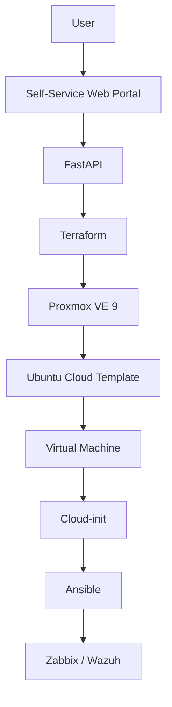

# Architecture

## Overview

The Proxmox Self-Service VM Platform is intended to provide a controlled, repeatable workflow for requesting and provisioning virtual machines in a Proxmox VE 9 laboratory environment. Users will interact with a self-service web portal, while a FastAPI backend will coordinate infrastructure provisioning and post-provisioning configuration.

The planned architecture is:



## Provisioning Flow

1. A user submits a virtual machine request through the self-service web portal.
2. The FastAPI backend validates the request against the platform's policies and resource limits.
3. FastAPI initiates the Terraform workflow with the approved parameters.
4. Terraform communicates with the Proxmox API and clones the Ubuntu cloud template.
5. Proxmox creates the requested virtual machine and applies its infrastructure settings.
6. Cloud-init performs the virtual machine's first-boot configuration.
7. Ansible applies the operating-system baseline and installs the required operational agents.
8. Zabbix and Wazuh provide monitoring and security visibility.

## Provisioning Process

Provisioning is divided into distinct layers so that infrastructure creation, first-boot initialization, and ongoing operating-system configuration remain independently maintainable. Terraform owns the infrastructure lifecycle. Cloud-init supplies the minimum configuration required to make a new instance reachable and identifiable. Ansible then applies the repeatable system baseline and integrations.

The portal and API will eventually expose this workflow without requiring users to access Proxmox directly. Validation, authorization, auditability, and failure reporting will be handled before the platform is considered production-ready.

## Terraform Responsibilities

Terraform will be responsible for infrastructure provisioning through the Proxmox API. Its scope will include cloning the approved Ubuntu cloud template and defining the virtual machine's compute, memory, disk, and network resources. Terraform will remain the authoritative layer for infrastructure lifecycle operations and must not contain embedded credentials or environment-specific secrets in version control.

## Cloud-init Responsibilities

Cloud-init will perform the initial guest configuration needed during first boot:

- Set the hostname.
- Create and configure the initial user.
- Install the authorized SSH public key.
- Configure the IP address.
- Configure DNS settings.
- Configure the timezone.

Cloud-init should remain focused on bootstrap tasks. Longer-running or reusable operating-system configuration belongs in Ansible.

## Ansible Responsibilities

Ansible will apply and maintain the operating-system baseline after the virtual machine becomes reachable. Its planned responsibilities are:

- Apply operating-system updates.
- Install required packages.
- Install and configure Docker.
- Install and enable the QEMU Guest Agent.
- Apply SSH hardening.
- Install and configure the Zabbix Agent.
- Install and configure the Wazuh Agent.

Playbooks should be idempotent so they can be run repeatedly without introducing unintended changes.

## Security Model

Automation must not use the Proxmox `root@pam` account. A dedicated automation user and an API token will be introduced in a later phase, with permissions limited according to the principle of least privilege.

Secrets and sensitive operational data must never be committed to the repository. This includes:

- API tokens and passwords.
- SSH private keys.
- Terraform state files (`.tfstate` and related state artifacts).
- Terraform variable files (`.tfvars` and `.tfvars.json`).
- Environment files (`.env` and related variants).

Public SSH keys and sanitized examples may be documented later, but all examples must use non-production placeholder values. Authorization, request validation, audit logging, and separation of duties will be expanded in later milestones.

## Initial Resource Limits

The first implementation will be restricted to the LAB network and will enforce the following planned request boundaries:

| Resource | Allowed values |
| --- | --- |
| CPU | 1–4 vCPU |
| RAM | 2 GB, 4 GB, or 8 GB |
| Disk | 20–100 GB |
| Network | LAB only |

These limits are initial guardrails and may be revised after capacity, performance, and governance requirements are validated.

## Initial Milestone

The first milestone intentionally focuses only on proving the infrastructure provisioning path:

```text
Terraform
    ↓
Proxmox API
    ↓
Clone Ubuntu Template
    ↓
Virtual Machine Created
```

The web portal, FastAPI orchestration, Cloud-init customization, Ansible configuration, monitoring, and security-agent integrations will follow after this foundational workflow has been validated.
