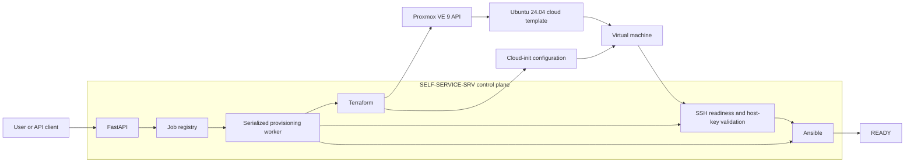
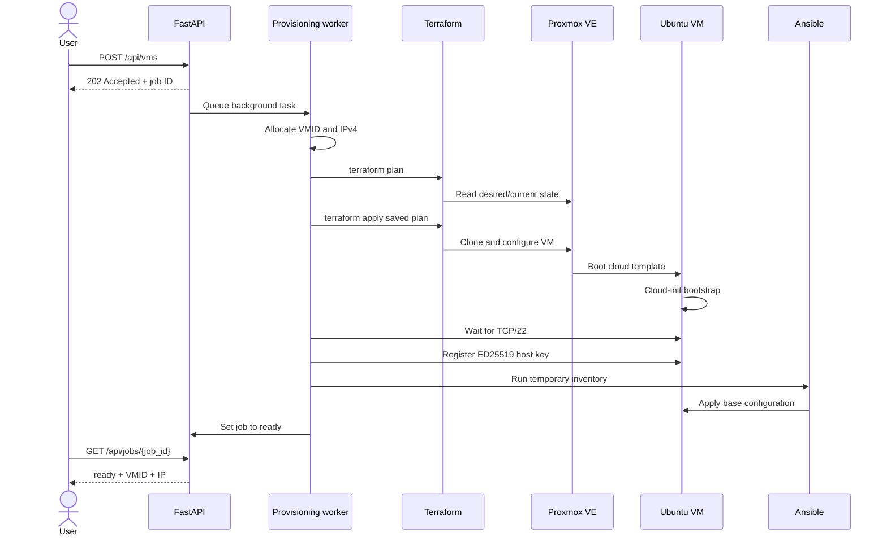
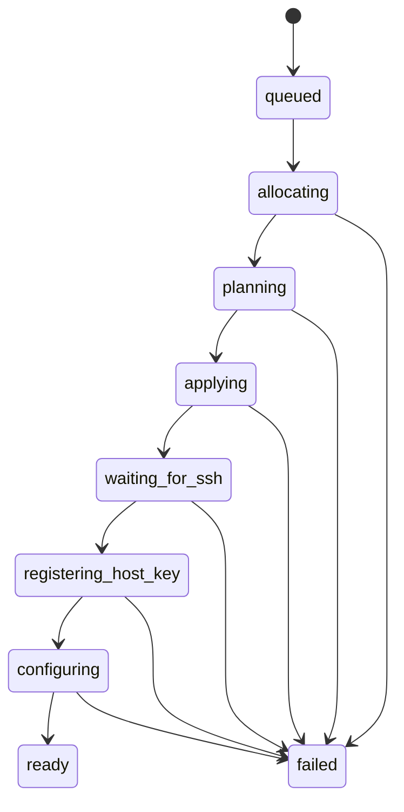
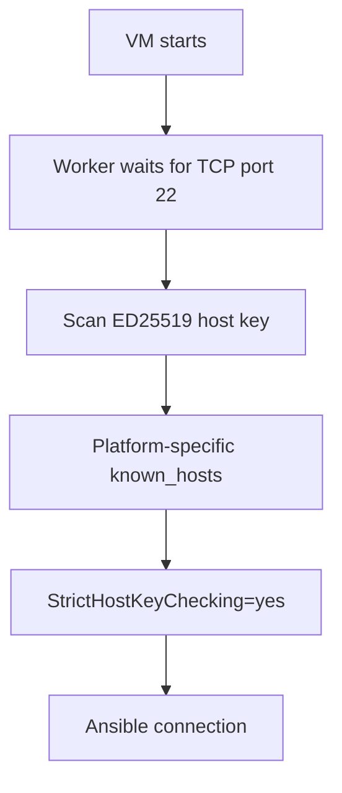
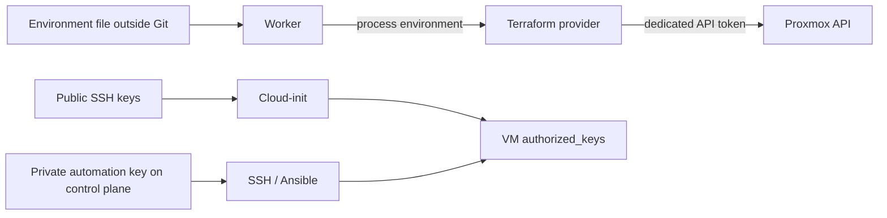

# Architecture

## Overview

The Proxmox Self-Service VM Platform is an internal infrastructure control plane for a Proxmox VE 9 lab. It accepts validated VM requests through FastAPI and coordinates Terraform, Proxmox, Cloud-init, SSH, and Ansible until the guest reaches a configured `ready` state.

The current control plane runs on `SELF-SERVICE-SRV`. Centralizing orchestration there removes the dependency on a personal workstation and keeps Terraform state, automation identities, and configuration tooling in one controlled environment.

## Control Plane

`SELF-SERVICE-SRV` owns the automation runtime:

- FastAPI receives and validates requests.
- The provisioning worker allocates resources and coordinates tools.
- Terraform manages infrastructure and its local state.
- Ansible applies the guest operating-system baseline.
- Dedicated SSH keys and a separate `known_hosts` file support secure guest access.

The API currently uses in-memory job storage and FastAPI background tasks. A process-wide lock allows only one Terraform operation at a time. This is appropriate for the current single-process lab deployment, but a multi-instance service will require a durable queue, persistent job database, and distributed locking.

## Provisioning Pipeline

## Job State Model

Infrastructure existence and service readiness are deliberately different states. Terraform may have created a VM while SSH or configuration management is still incomplete. Only a successful Ansible run moves the job to `ready`.

## Terraform

Terraform is responsible for infrastructure provisioning through the Proxmox API. The `bpg/proxmox` provider clones an approved Ubuntu template and configures:

- stable resource identity through `for_each`;
- VMID and VM name;
- vCPU and memory;
- SCSI disk and storage placement;
- LAB network bridge;
- Cloud-init data;
- QEMU Guest Agent channel;
- VM power state.

Terraform merges manually declared `vms` with API-managed `portal_vms`. The latter is held in an ignored runtime file so the service can update desired state without committing environment-specific allocations.

Terraform state and execution are located on the control plane. A worker lock serializes operations against the shared state. The provider does not wait for a guest-agent address during initial provisioning because the guest package may not be active until Ansible runs.

## FastAPI

FastAPI provides the initial platform interface:

- `GET /api/health`
- `POST /api/vms`
- `GET /api/jobs`
- `GET /api/jobs/{job_id}`

Pydantic validates names and resource ranges before a request becomes a job. The current API is intentionally small and has no authentication yet, so it must remain within a trusted lab network.

## Cloud-init

Cloud-init performs only the bootstrap needed for remote management:

- initial hostname and user;
- static IP address and gateway;
- DNS server and search domain;
- operator, platform, and Ansible public keys.

Longer-running package operations are handled by Ansible. This reduces reliance on Cloud-init and makes configuration retryable and idempotent.

## SSH Trust Flow

The automation uses dedicated Ed25519 keys. Private keys stay on the control plane and only public keys are passed through Cloud-init. Host-key checking is not disabled. A separate platform `known_hosts` file prevents automation from modifying a personal SSH trust store.

The current `ssh-keyscan` registration should be strengthened for production by obtaining or validating the expected fingerprint through a trusted channel.

## Ansible

After SSH becomes reachable, the worker creates a temporary inventory for the requested VM and runs `ansible/playbooks/base.yml`. The playbook refreshes APT with retries, installs the base utility set and `qemu-guest-agent`, enables the agent, and configures the timezone.

The temporary inventory is deleted after execution. A second playbook run completed with `changed=0` and `failed=0`, validating idempotence for the current baseline.

## Network and Resource Allocation

The platform is currently restricted to the LAB network. Portal allocations use VMIDs beginning at `9400` and addresses from the configured host range `.110` through `.199`. The allocator checks the portal desired-state map before selecting the first free values.

Current API limits are broader than the original manual Terraform catalog:

| Resource | Portal request limit |
| --- | --- |
| CPU | 1-8 vCPU |
| RAM | 1,024-16,384 MB |
| Disk | 20-200 GB |
| Network | LAB only |

Future versions should use authoritative Proxmox and IPAM checks, transactional reservations, quotas, and approval policies.

## Credential Flow

Credentials are never embedded in Terraform source. The worker loads provider settings from a control-plane environment file outside the repository. Terraform state, real tfvars, plan artifacts, `.env` files, private keys, and generated inventories are excluded by `.gitignore`.

## Security Boundaries

- Proxmox automation must use a dedicated identity and least-privilege API token, never `root@pam`.
- The API is currently trusted-network only because authentication and RBAC are not implemented.
- Private SSH keys and Proxmox credentials remain on `SELF-SERVICE-SRV`.
- SSH host-key checking remains enabled.
- Terraform operations are serialized to protect shared state.
- Request limits are validated at the API and Terraform layers.
- Sensitive runtime artifacts are local and unversioned.

## Failure Handling

If `terraform plan` fails before apply begins, the worker restores the previous portal desired-state file. After apply starts, the worker does not automatically destroy or roll back infrastructure because the actual remote state may have changed. The failed job retains an error summary for troubleshooting.

This behavior favors preservation over destructive recovery. A future reconciler should inspect Terraform and Proxmox state before deciding whether to resume, import, quarantine, or remove a partial resource.

## Current Scope and Future Evolution

The current milestone proves an end-to-end path from API request to configured VM. Planned platform capabilities include persistent jobs, an external task queue, distributed locking, API authentication, RBAC, approvals, quotas, expiration, lifecycle operations, observability, security agents, CI/CD, and a web portal.
