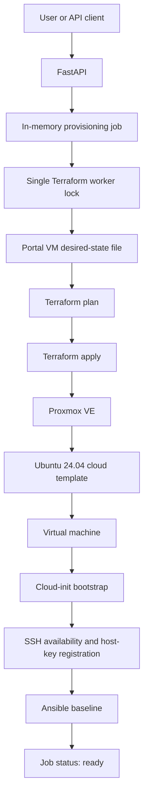
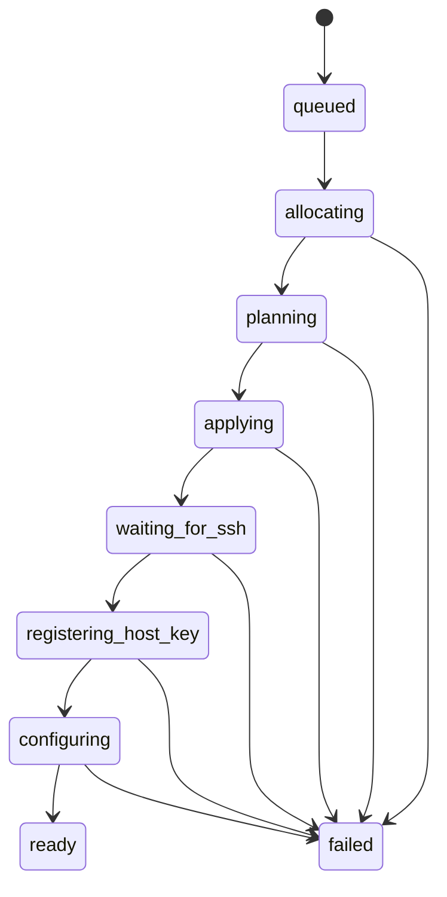

# Implementation Guide

## Project Objective

The Proxmox Self-Service VM Platform is a working infrastructure automation prototype for an internal private cloud. It exposes a small FastAPI service that accepts virtual machine requests and coordinates Terraform and Ansible from a dedicated automation host named `SELF-SERVICE-SRV`.

The project addresses a common operational problem: provisioning a useful VM requires more than creating a guest in a hypervisor. Infrastructure must be allocated consistently, credentials must remain protected, networking and SSH must become available, and the operating system must reach a known configuration before the request can be considered complete.

The current implementation turns that multi-tool process into one asynchronous provisioning job.

## Implemented Architecture



`SELF-SERVICE-SRV` is the control plane. It contains the checked-out repository and runs FastAPI, Terraform, Ansible, the provisioning worker, and the automation SSH material. Centralizing these components removes the runtime dependency on a personal workstation and gives the workflow one controlled execution environment.

## Technology Stack

| Layer | Technology | Current responsibility |
| --- | --- | --- |
| API | Python, FastAPI, Pydantic | Request validation, job creation, and status endpoints |
| Orchestration | Python worker | Resource allocation and lifecycle coordination |
| Infrastructure as Code | Terraform, `bpg/proxmox` | VM clone, compute, storage, network, and Cloud-init configuration |
| Virtualization | Proxmox VE | Runs the Ubuntu virtual machines |
| Bootstrap | Ubuntu 24.04 Cloud-init | Initial user, network, DNS, and SSH public keys |
| Configuration management | Ansible | Package installation, timezone, and QEMU Guest Agent |
| Access | OpenSSH | Availability checks, host-key validation, and Ansible transport |

## Repository Structure

```text
proxmox-self-service-platform/
|-- ansible/
|   `-- playbooks/base.yml
|-- backend/
|   |-- main.py
|   `-- provisioner.py
|-- docs/
|   |-- architecture.md
|   |-- implementation.md
|   `-- screenshots/
|-- frontend/
|-- scripts/
|-- terraform/
|   |-- main.tf
|   |-- outputs.tf
|   |-- providers.tf
|   |-- terraform.tfvars.example
|   `-- variables.tf
|-- .gitignore
`-- README.md
```

Runtime files such as Terraform state, real variable files, generated inventories, environment files, plans, and private keys are intentionally excluded from Git.

## Terraform Implementation

Terraform uses the `bpg/proxmox` provider and models VMs with `for_each`, giving each VM a stable resource address based on its name. The effective VM catalog is built by merging two maps:

- `vms`: manually managed laboratory VMs from the local Terraform configuration.
- `portal_vms`: VMs allocated by the self-service API and stored in the ignored `portal.auto.tfvars.json` runtime file.

Each entry defines the VMID, CPU count, memory, disk size, and static IPv4 address. Terraform then:

1. clones the approved Ubuntu cloud template;
2. assigns compute, memory, storage, and the LAB bridge;
3. configures Cloud-init DNS and IPv4 settings;
4. adds the operator, platform, and Ansible public keys;
5. enables the Proxmox QEMU Guest Agent setting;
6. starts the VM.

The provider is configured not to wait for a guest-agent IP during creation. This is intentional: the base image may not have a running agent yet, and Ansible installs and enables it later. SSH availability is the explicit readiness gate between Terraform and Ansible.

Terraform execution and state are centralized on `SELF-SERVICE-SRV`. A migration from the original Windows workstation was verified with `terraform state list` and a no-drift `terraform plan`.

## FastAPI Service

The API is implemented in `backend/main.py`. Its current endpoints are:

| Method | Endpoint | Purpose |
| --- | --- | --- |
| `GET` | `/api/health` | Basic service health check |
| `POST` | `/api/vms` | Validate a request and queue VM provisioning |
| `GET` | `/api/jobs` | List jobs held by the current process |
| `GET` | `/api/jobs/{job_id}` | Return one job and its current state |

Pydantic validates the VM name and enforces API resource bounds before any infrastructure command runs. Duplicate active requests for the same VM name return HTTP `409`.

The API returns HTTP `202 Accepted` and delegates provisioning to a FastAPI background task. Jobs are currently stored in an in-memory dictionary, so they do not survive an API restart and are not shared across multiple application processes. Persistent job storage is a future milestone.

## Provisioning Job States



The distinction between `applying` and `ready` is important. A VM that exists in Proxmox is not necessarily usable. The platform reports `ready` only after the guest accepts SSH connections, its SSH host key is registered, and the Ansible playbook completes successfully.

## VMID and IP Allocation

The worker reserves resources from deterministic portal ranges:

- VMIDs start at `9400` and advance to the first unused value.
- IPv4 addresses are selected from host addresses `110` through `199` in the configured LAB subnet.

Allocation checks the existing `portal_vms` desired-state map. The worker saves the new entry before planning, allowing Terraform to calculate the complete desired infrastructure.

This allocator is intentionally small and suitable for the current lab. Production evolution should validate conflicts against Proxmox and an authoritative IPAM system, reserve resources transactionally, and enforce quotas.

## Provisioning Worker

`backend/provisioner.py` implements the end-to-end workflow:

1. acquire the process-wide Terraform lock;
2. load portal-managed VMs;
3. reject an existing VM name;
4. allocate a VMID and IPv4 address;
5. atomically update the portal desired-state file;
6. run `terraform plan` into a temporary plan artifact;
7. run `terraform apply` using that saved plan;
8. wait for TCP port 22;
9. register and record the SSH host-key fingerprint;
10. generate a temporary Ansible inventory;
11. execute the base playbook;
12. mark the job as `ready`.

A `threading.Lock` serializes Terraform operations inside the API process. This protects the shared state and desired-state file from concurrent background tasks. It is not yet a distributed lock: running multiple API workers would require an external queue and locking mechanism.

If planning fails before apply starts, the worker restores the previous desired-state file. Once apply may have changed infrastructure, it deliberately avoids an automatic rollback because destroying or rewriting partially created infrastructure would be unsafe without a reconciler.

## Cloud-init

Cloud-init provides the minimum guest bootstrap configuration required to make the VM reachable:

- hostname derived from the Terraform resource name;
- initial `devops` account;
- static IPv4 address and gateway;
- DNS servers and search domain;
- operator, platform, and Ansible SSH public keys.

Cloud-init is not treated as the final readiness signal. It prepares access, while Ansible owns the repeatable operating-system baseline.

## SSH and Host-Key Validation

After Terraform completes, the worker waits for port 22 with a bounded timeout. It then scans the VM's ED25519 host key, stores it in a platform-specific `known_hosts` file, and configures Ansible with `StrictHostKeyChecking=yes`.

Strict host-key checking was not disabled. During VM recreation tests, the team validated the VM identity and ED25519 fingerprint before updating the known-host entry. Separating the platform file from a user's personal `known_hosts` also limits automation side effects.

The current registration flow uses `ssh-keyscan`, which proves continuity only after the fingerprint has been independently validated or delivered through a trusted channel. A production implementation should obtain the expected fingerprint from a trusted guest bootstrap mechanism or another authenticated source.

## Ansible Configuration

The worker writes a short-lived inventory for the requested VM and deletes it after execution. The current playbook:

- refreshes the APT cache with retries;
- installs `qemu-guest-agent`, `curl`, `git`, `vim`, `unzip`, `htop`, and `ca-certificates`;
- enables and starts `qemu-guest-agent`;
- configures the `America/Sao_Paulo` timezone.

The playbook was executed twice against a configured VM. The second execution reported `changed=0` and `failed=0`, demonstrating idempotence for the current task set.

## QEMU Guest Agent

Enabling the agent device in Proxmox and installing the guest package are separate responsibilities:

- Terraform enables the virtual QEMU Guest Agent channel.
- Ansible installs and starts the agent inside Ubuntu.

The integration was validated through Proxmox with `qm agent 9400 get-host-name`, which returned the guest hostname for `portal-dev-01`.

## Security Model

- Proxmox automation uses a dedicated API identity and token rather than `root@pam`.
- Secrets are loaded from an environment file outside the repository.
- Terraform state, real tfvars, plan files, environment files, private keys, and generated inventories are ignored.
- Cloud-init receives public keys only; private keys remain on the authorized control plane.
- The platform and Ansible use dedicated Ed25519 identities.
- SSH host-key checking remains enabled with a separate platform `known_hosts` file.
- Terraform runs are serialized to reduce state corruption risk.
- Temporary Ansible inventory files are deleted after use.

The current API has no authentication, authorization, durable audit log, or persistent queue. It must remain limited to a trusted lab network until those controls are implemented.

## Lessons Learned / Troubleshooting

### Terraform state migration

Terraform was originally executed from a Windows workstation. Its state and execution responsibility were moved to `SELF-SERVICE-SRV`. Running `terraform state list` followed by `terraform plan` confirmed that the migrated state still matched the Proxmox resources and introduced no drift.

### SSH public-key dependency

The original Terraform configuration referenced a public key available only on the workstation. Moving execution exposed that hidden dependency. The required public key was installed on the automation server, and a dedicated platform key was later introduced so lifecycle automation no longer relies on a personal machine.

### SSH host key changed

Recreating test VMs reused addresses and triggered legitimate SSH host-key warnings. Instead of disabling verification, the VM MAC address and ED25519 fingerprint were checked, the stale entry was replaced, and a dedicated platform `known_hosts` file was adopted.

### Cloud-init and Ubuntu mirror availability

During testing, an Ubuntu mirror was temporarily inconsistent while Cloud-init ran `apt update`. Cloud-init reported an error even though the VM later became reachable and functional. The workflow was changed so readiness does not depend solely on `cloud-init status`: it waits for SSH and lets Ansible perform package configuration with retries.

### QEMU Guest Agent

The Proxmox setting `agent: enabled=1` only creates the guest-agent channel; it does not install software inside Ubuntu. Ansible now installs, enables, and starts `qemu-guest-agent`, while Terraform avoids waiting for the agent during initial creation.

### Ansible idempotence

The base playbook was rerun after successful configuration. The second run reported no changes and no failures, confirming that the current automation converges rather than repeatedly modifying the guest.

## Current Result

Two test VMs have been provisioned through the portal-managed Terraform catalog:

| VM | VMID | Address | Result |
| --- | ---: | --- | --- |
| `portal-dev-01` | 9400 | `172.16.16.110/24` | Provisioned and validated |
| `portal-dev-02` | 9401 | `172.16.16.111/24` | Reached `ready` through the automated pipeline |

`portal-dev-02` required no manual guest configuration after the API request.

## Next Steps

1. Add API authentication and role-based authorization.
2. Replace in-memory jobs with a durable database and task queue.
3. Replace the process lock with distributed Terraform serialization.
4. Add authoritative VMID/IP conflict checks and IPAM integration.
5. Add request quotas, approvals, expiration, and deletion workflows.
6. Persist structured logs and audit events without exposing secrets.
7. Add automated tests for allocation, failure recovery, and API behavior.
8. Integrate Zabbix and Wazuh after the base provisioning workflow is stable.
9. Build the self-service web portal.
